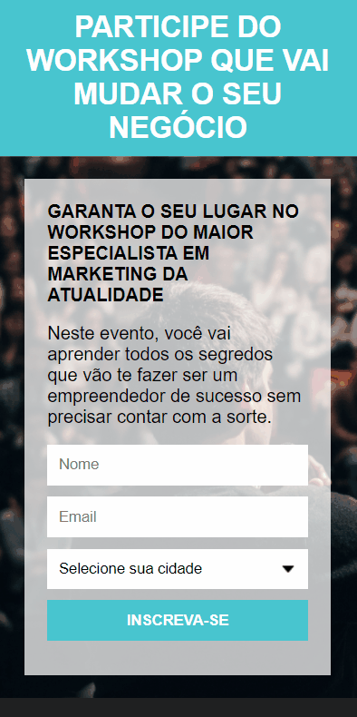
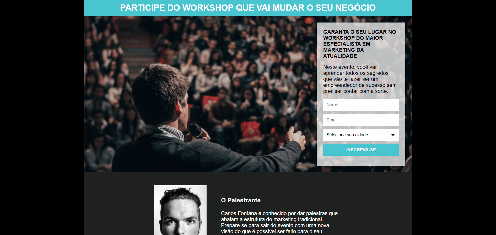

<h1 align="center">
   Página de captura
</h1>

 

## 💻 Projeto

Página de captura para um workshop onde o usuário pode inserir suas informações para receber novidades sobre o workshop.

## 📷 Demonstração

  ### Mobile 📱  
  

   
  
  ### Desktop 💻
  

 

## 🚀 Tecnologias utilizadas:

✔️ HTML

✔️ CSS